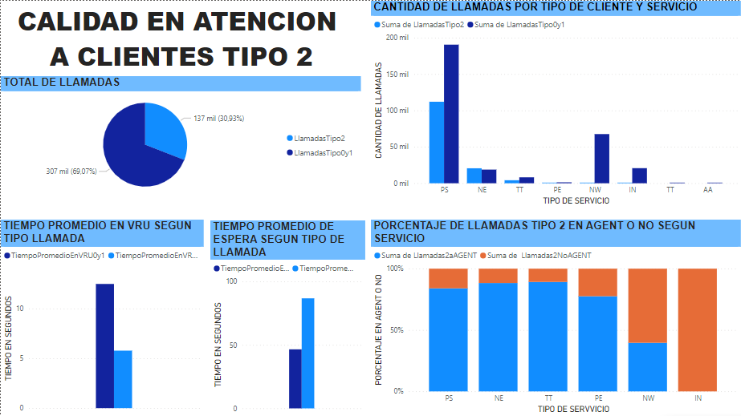
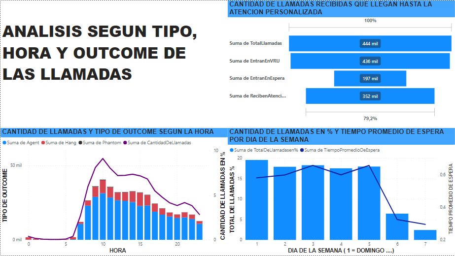

# Proyecto Call Center 

## Tecnologias Utilizadas 

- Python 
- Power Bi 
- MySql
- Pandas

## Lenguajes utilizados 

- Python 
- DAX 
- SQL 

## DataSet Utilizado 
* [DATASET](/Resolucion%20Integrador/Call%20Center/Call_Center_1999_DataSet.csv) 
* [Descripcion DATASET](/Resolucion%20Integrador/Call%20Center/Ejercicio%20Call%20Center%20-%20Descripción%20del%20DataSet.docx)
## Topicos a Tratar 

* Eficiencia operativa, proponiendo mejoras operativas.
* Mejorar la satisfacción del cliente, cumpliendo los SLA comprometidos.
* Brindar una herramienta para la gestión y la toma de decisiones a los managers del Call Center.

## Informes 
* [INFORME COMPLETO](/Resolucion%20Integrador/Call%20Center/informearkdown.md)
* [DOCUMENTACION DE LA RESOLUCION](/Resolucion%20Integrador/Call%20Center/Documentacion.md)

### Consideraciones Importantes
Si bien en la documentacion de la resolucion se encuentran las principales herremientas y pasos seguidos para realizar el analisis de este DataSet hay pasos que se han omitido ya sea por su complejidad para traducirlos a los otros lenguajes, por que se han utilizado herramientas del programa Power Bi o por simple omision. 

Ademas se omite todo el paso previo a la programacion como por ejemplo el planteo de posibles soluciones ideas de como encarar el proyecto , como detectar los errores y muchos más pasos previo a lo plasmado en la documentacion. 

## Dash Board obtenido 

