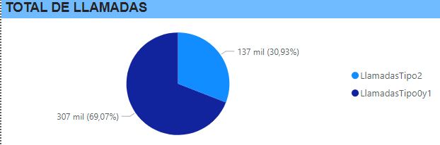
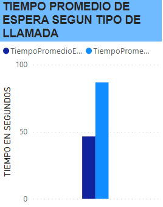
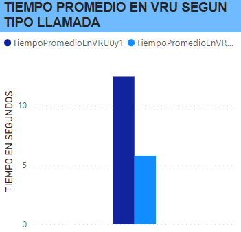
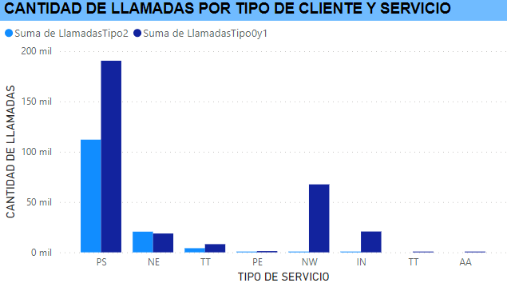
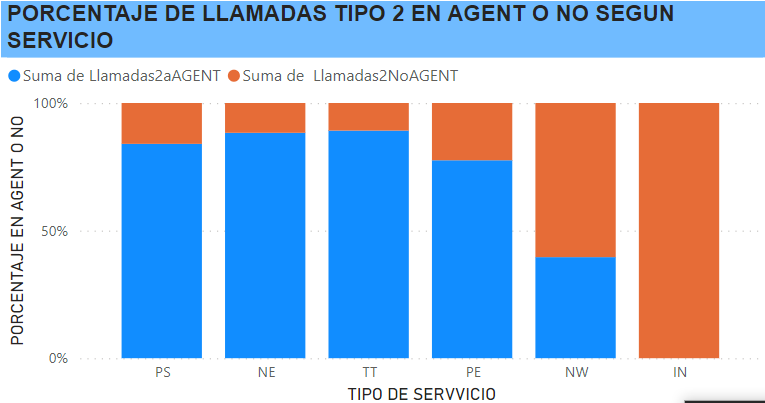
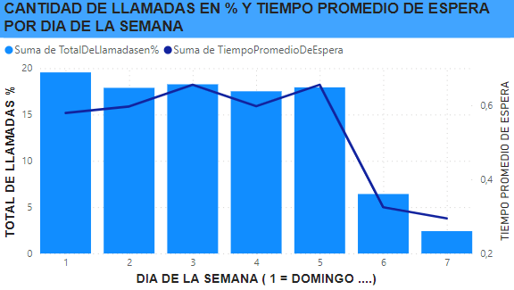

# "Anonymous Bank"

## TÓPICOS A TRATAR

- Eficiencia operativa, proponiendo mejoras operativas.
- Mejorar la satisfacción del cliente, cumpliendo los SLA comprometidos.
- Brindar una herramienta para la gestión y la toma de decisiones a los managers del Call Center.

## PREGUNTAS GUIA

- ¿Cuál es el nivel de servicio para los clientes Prioritarios?
- ¿Damos un mejor servicio que a los clientes normales?
- ¿Qué volumen de llamadas atendemos?
- ¿Cuáles son los cuellos de botella? ¿En qué días? ¿En qué bandas horarias?
- ¿Cómo es la eficiencia y productividad de nuestros agentes?
- ¿Hay clientes recurrentes en el uso del servicio?
- ¿Cuáles son los tipos de servicio más recurrentes?
- ¿Podemos estimar la dotación necesaria para cumplir con una calidad de servicio determinada? Ejemplo: si quiero que mi tiempo promedio de espera sea menor a 60 segundos?

## INFORME

### Análisis de beneficios y atención a clientes prioritarios

Del total de llamadas registradas en la base de datos, el 30.93% (137,453) pertenece a clientes prioritarios y el 69.07% (306,997) restante a los clientes no prioritarios.

El primer punto a observar es que, si bien el sistema de VRU está configurado para ingresar a los clientes prioritarios con una ventaja de 1.5 minutos en la espera para recibir atención de un agente. En el siguiente gráfico, podemos observar cómo, a pesar de esta ventaja, los usuarios prioritarios pasan en promedio 20 segundos más en espera que los otros usuarios.

Pero a su vez son los que menos tiempo pasan en el sistema VRU.

Si revisamos el tipo de consulta que realizan los dos distintos tipos de clientes podemos ver una clara diferencia en los siguientes items:

- PS - Actividad Regular
- PE - Actividad Regular en inglés
- IN - Actividad / Consulta por internet
- NE - Actividad por Acciones (stock exchange)
- NW - Cliente potencial (prospecto) solicitando información
- TT – Clientes que dejan un mensaje pidiendo al banco que le devuelvan su llamado pero que cuando el sistema automático devuelve el llamado, el agente pasó a estado “ocupado”, dejando al cliente en espera en la cola.

Del total de llamadas de clientes prioritarios que se clasifican como PS, el 83.98% (94,095) recibieron atención personalizada. Los clasificados como NE reciben atención personalizada el 88.31% (18,173) de las veces. Luego, los clasificados como TT reciben atención personalizada en el 89% de los casos, y por último, los PE que son atendidos por agentes en el 77.55% de las veces.

### Análisis según hora y día:

Analizando según el día de la semana y el tiempo promedio en espera, podemos decir que los días martes y jueves son los que tienen un tiempo promedio de espera mayor a 60 segundos. Con una caída considerable en la cantidad de llamadas recibidas y en el tiempo de espera para los días viernes y sábado y aumentando considerablemente la cantidad de llamadas el día domingo (siendo el día en que más llamadas se reciben) pero su tiempo promedio de espera se mantiene por debajo de los 60 segundos.

Ahora, si lo analizamos hora a hora, podemos ver que el mayor cuello de botella se da a las 15:00, donde el 28.58% de llamadas que se reciben en esa hora no son atendidas. Las llamadas recibidas a las 15:00 representan el 7.18% del total de las llamadas recibidas al día. Otro cuello de botella se da a las 10:00, donde se reciben el 9.12% del total de las llamadas diarias. Quedando así el 22.70% de las llamadas recibidas a las 10:00 sin atender.

### Soluciones:

Lo que se logra destacar después de este análisis y desglose de ítems es el siguiente:
Los clientes Prioritarios no reciben un mejor servicio en comparación a los no prioritarios. Esto queda en evidencia al sacar el promedio de tiempo de espera donde se ve que los clientes prioritarios pasan en promedio 20 segundos más en espera que los no prioritarios, especialmente los días martes y jueves.
Hay dos cuellos de botella considerables: uno a las 15:00 y otro a las 10:00. Estos problemas se pueden resolver de tres formas a mi parecer:

1. Aumentar el tiempo de ventaja que se les otorga a los clientes Prioritarios en un 60%, quedando en un beneficio en la lista de espera de 2.4 minutos, reduciendo el promedio de espera para los clientes prioritarios de 34.72 a 11.84 segundos menos de espera que un cliente no prioritario.
2. Automatizar las consultas de tipo PS (nos concentramos en este tipo de clientes ya que sus llamadas atendidas por agentes representan el 68.45% de las llamadas de tipo PRIORITARIO y el 21% del total de llamadas). Otra solución es automatizar las consultas de tipo PS, para lograr esto se deben identificar las consultas generales y aquellas preguntas frecuentes para añadirlas al sistema VRU logrando así liberar la cola de espera, ya que el usuario resolverá sus dudas a través del VRU o al menos una parte de ellas, agilizando y aliviando la demanda de Agentes. Si se logra que solo el 46.08% de las llamadas lleguen a ser atendidas por un agente, el tiempo de espera se reduciría a 40 segundos, casi 7 segundos menos que un cliente no prioritario.
3. La tercera opción sería un híbrido entre la opción uno y dos: aumentar la ventaja en la cola y además complejizar el sistema VRU.
4. Acomodar la cantidad de personal disponible para que haya una mayor cantidad de agentes disponibles los días Martes y Jueves con especial atención en las siguientes horas 15:00 y 10:00.
